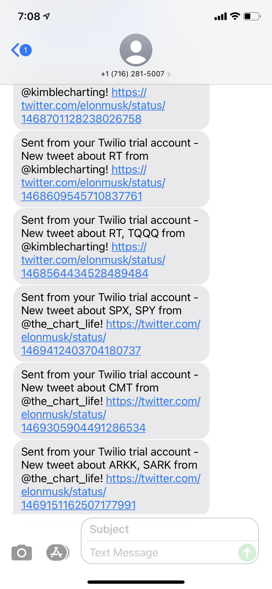

# OIMproject

## Getting Started

```bash
# Create and activate python virtual environment, if desired.

# Install project dependencies
pip install -r requirements.txt

# Configure environment variables for Twitter/Twilio secret keys in .env file.
# See all required variables in config.py

# Start program using desired launcher/runner
python3 main.py
```

## Output Preview



## Planning

**The Big Idea: What is the main idea of your project? What topics will you explore and what will you generate? What is your minimum viable product? What is a stretch goal?**

Create a program that explores twitter and looks at specific accounts. The accounts will be given accounts that update on news of a stock / price movement of a stock. The program will constantly search these accounts for any given stock tickers/stock names in real time. Once a Ticker/Name is found, the program will notify the user about the twitter post.

- The minimum viable product will search one specified account for one stock ticker in real time, and then send out an alert about the relevant twitter post.

- A stretch goal will be a program that searches multiple twitter accounts for multiple stock tickers and sends push notifications to the user in real time. Correlations between different tweets can generate insights that are also sent in a push notification so that the notification not only notifies about the tweet, but also gives some sort of insight and reasoning about the news/price movement.

**Learning Goals: Since this is a team project, you may want to articulate both shared and individual learning goals.**

In this project, we would like to learn how to build a real world application. Utilizing both the knowledge we learned from class and master “googling” skills so we can build more complex things after this course is ended.

- Michael: Learning to make my first real Python Project. Creating something that I am proud of and can show off :)

- Roger: my individual goal is learning how to understand the difficulties and tasks an engineer has to do in a project. Another goal of mine is to learn from Pujit, who has managed multiple engineering projects and figured out the best practices to work cross functionally with future engineers.

**Implementation Plan: this will probably be pretty vague initially. Perhaps at this early juncture you will have identified a library or a framework that you think will be useful for your project. If you don't have any idea how you will implement your project, provide a rough plan for how you will determine this information.**

- Find library to interface with Twitter API
- Use API to listen to tweets from specific users (feed subscriptions)
- Notify (via text message) a list of people when tweets contain some predetermined static text (event hook)
- Run as either background/worker service or on cron schedule

Step 2 is dependent on step 1. Steps 2, 3, and 4 can be developed concurrently and independently. Unit testing will focus on step 2. Behavior of runtime error handling is TBD. Desirability of application crash/downtime-resistance is also up for discussion. Deployment may occur on any third-party web server or local development node.

**Project schedule: You have 8 weeks (roughly) to finish the project. Sketch out a rough schedule for completing the project. Depending on your project, you may be able to do this in great specificity or you may only be able to give a broad outline. Additionally, longer projects come with increased uncertainty, and this schedule will likely need to be refined along the way.**

- Learning about the software development cycle (1 week)
- Find library to interface with Twitter API (1 week)
- Learning how to use the library to draft some code to organize the tweets we get?(2-4 weeks)
- Figure out how to notify people and finish first draft of the MVP (2 weeks)
- Deploy the product (1 week)

**Collaboration plan: How do you plan to collaborate with your teammates on this project? Will you split tasks up, complete them independently, and then integrate? Will you pair program the entire thing? Make sure to articulate your plan for successfully working together as a team. This might also include information about any software development methodologies you plan to use (e.g. agile development). Make sure to make clear why you are choosing this particular organizational structure.**
Communication tool: discord
Github: watch some youtube videos on collaborating properly on github
Agile processes: we meet once a week for 30 mins, what we have done last week, any questions we have and what are we going to do next week.
Roger and Michael: the main software engineer
Pujit: the supervisor, PM, and code reviewer.

**Risks: What do you view as the biggest risks to the success of this project?**

- We don’t find the right library and are force to learn machine learning
- Procrastination
- Lack of testing
- Getting frustrated and giving up prematurely

**Additional Course Content: What are some topics that we might cover in class that you think would be especially helpful for your project?**

- Working with API
- Read documentations
- Researching libraries
